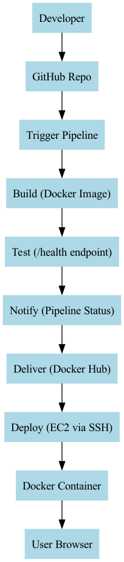

# 🚀 Containerized Application Deployment with Terraform & CI/CD

## 🧠 Overview

This project demonstrates a **fully automated, enterprise-style CI/CD pipeline** that builds, tests, and deploys a containerized application to the cloud.

The system eliminates manual deployment by automating the entire workflow from code commit to production deployment.

---

## 🧱 Architecture

---

## ⚙️ Technology Stack

- Node.js (Express application)
- Docker (containerization)
- Terraform (Infrastructure as Code)
- GitHub Actions (CI/CD automation)
- AWS EC2 (cloud compute)
- SSH (secure remote deployment)

---

## 🔁 CI/CD Pipeline Flow

This project implements a **complete pipeline lifecycle**:

1. **Commit**  
   Developer pushes code to GitHub  

2. **Trigger**  
   GitHub Actions pipeline starts automatically  

3. **Build**  
   Docker image is created from the application  

4. **Test**  
   Application is validated using `/health` endpoint  

5. **Notify**  
   Pipeline logs indicate success/failure  

6. **Deliver**  
   Docker image is pushed to Docker Hub  

7. **Deploy**  
   EC2 pulls the image and runs the container  

---

## 🧪 Health Check

The application includes a health endpoint:
/health

Used in CI/CD to verify deployment readiness.

## 📁 Project Structure
containerized-app-terraform-cicd/
│
├── app.js
├── package.json
├── package-lock.json
├── .gitignore
├── README.md
│
├── Dockerfile
├── .dockerignore
│
├── ecosystem.config.js              # Included (enterprise process config)
│
├── terraform/
│   ├── main.tf
│   ├── variables.tf                 # REQUIRED
│   ├── outputs.tf
│   └── terraform.tfvars             # REQUIRED
│
├── docs/
│   ├── architecture-diagram.png     # REQUIRED
│   └── architecture.dot
│
└── .github/
    └── workflows/
        └── deploy.yml

## 🌐 Application Access

After deployment, access the application via:
http://<EC2-PUBLIC-IP>

---

## 🎯 Key DevOps Principles Demonstrated

- Infrastructure as Code (Terraform)
- Containerization (Docker)
- Automation (CI/CD pipeline)
- Health-based validation
- Secure deployment via SSH

---

## ⚠️ Common Mistakes

- Missing `/health` endpoint
- Incorrect Docker image name
- Not exposing correct ports
- Forgetting to commit architecture diagram
- Misconfigured GitHub Secrets

---

## 🏁 Conclusion

This project showcases a **production-style DevOps pipeline** where:

Code → Build → Test → Deliver → Deploy

are fully automated, ensuring reliability, consistency, and scalability.