# 🚀 ENTERPRISE CI/CD RECOVERY PIPELINE

# PROJECT TITLE
Enterprise CI/CD Pipeline with Terraform, Docker, GitHub Actions, AWS EC2, Route53, Nginx, and HTTPS Automation

# AUTHOR
Anthony Uchenna Emeribe

# DOMAIN
https://auemeribetech.com.ng

# PROJECT CATEGORY
Enterprise DevOps | CI/CD Automation | Infrastructure as Code | Production Deployment Engineering

# ARCHITECTURE MODEL
Stable Infrastructure + Application-Level CI/CD Deployment + Automated HTTPS Reverse Proxy Architecture

# TECHNOLOGY STACK
✔ AWS EC2  
✔ AWS Route53  
✔ Terraform  
✔ Docker  
✔ GitHub Actions  
✔ Node.js  
✔ Express.js  
✔ Docker Hub  
✔ S3 Remote Backend  
✔ Native S3 State Locking  

---

# 📌 PROJECT OVERVIEW


This project demonstrates a production-grade DevOps deployment architecture using:

✔ AWS EC2  

✔ Terraform Infrastructure as Code  

✔ GitHub Actions CI/CD Automation  

✔ Docker Containerization  

✔ Docker Hub Image Registry  

✔ Route53 DNS Management  

✔ Nginx Reverse Proxy  

✔ HTTPS SSL Automation  

✔ Stable Infrastructure Architecture  

✔ Application-Level Deployment Automation  

✔ Remote Terraform State Management  

✔ Enterprise DevOps Deployment Workflow    

The infrastructure can be COMPLETELY destroyed using:

```bash
terraform destroy
```

Then automatically recreated using:

```bash
git push
```

OR

```bash
terraform apply
```

INCLUDING:

✔ EC2 recreation  
✔ Security group recreation  
✔ Dynamic public IP generation  
✔ Route53 DNS update  
✔ Docker redeployment  
✔ Domain restoration  
✔ Infrastructure recovery  

---

# ✅ ENTERPRISE PRODUCTION APPROACH

The architecture has now been upgraded to follow REAL enterprise DevOps standards.

Infrastructure is provisioned ONCE and remains stable.

GitHub Actions now updates ONLY the application layer during deployments.

This produces:

✔ Faster deployments  

✔ Stable infrastructure  

✔ Stable public IP and domain  

✔ Reduced downtime  

✔ Production-grade deployment workflow  

✔ Enterprise architecture standards  
---
## GITHUB ACTIONS RESPONSIBILITY

GitHub Actions is responsible ONLY for:

✔ Building Docker images  

✔ Pushing Docker images to Docker Hub  

✔ SSH deployment into EC2  

✔ Pulling updated Docker images  

✔ Replacing running containers  

✔ Updating the application layer ONLY  

Infrastructure is no longer recreated during application deployments.
---
# 🔥 COMPLETE ENTERPRISE EXECUTION FLOW


```text
🔥 FINAL ENTERPRISE EXECUTION FLOW

Developer
        ↓
Initial Terraform Deployment
        ↓
Stable EC2 Infrastructure Created
        ↓
Stable Route53 DNS Configured
        ↓
Nginx Reverse Proxy Configured
        ↓
HTTPS SSL Enabled
        ↓
Infrastructure Remains Stable
        ↓
Developer Pushes New Code
        ↓
GitHub Actions Triggered
        ↓
Docker Image Built
        ↓
Docker Image Pushed to Docker Hub
        ↓
SSH Into Existing EC2
        ↓
Updated Container Deployed
        ↓
Application Updated
        ↓
NO INFRASTRUCTURE RECREATION
        ↓
NO DNS PROPAGATION
        ↓
MINIMAL DOWNTIME
```

---

# 📌 PROJECT STRUCTURE


```text
containerized-app-terraform-cicd/
│
├── app.js
├── package.json
├── package-lock.json
├── README.md
├── .gitignore
├── .dockerignore
├── Dockerfile
├── ecosystem.config.js
│
├── scripts/
│   └── wait-for-instance.sh
│
├── terraform/
│   ├── main.tf
│   ├── variables.tf
│   ├── outputs.tf
│   ├── terraform.tfvars
│   └── versions.tf
│
├── docs/
│   ├── architecture.dot
│   └── architecture-diagram.png
│
└── .github/
    └── workflows/
        ├── deploy.yml
        └── destroy.yml
```

---

# ⚙️ STEP 1 — INSTALL REQUIRED TOOLS

# INSTALL NODE.JS


## MacOS

```bash
brew install node
```

## Verify

```bash
node -v
npm -v
```

Expected:

```text
v22.x.x
10.x.x
```

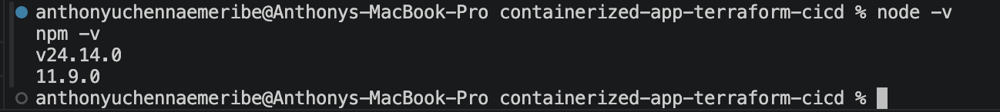

---

# INSTALL DOCKER DESKTOP

Download:

```text
https://www.docker.com/products/docker-desktop/
```

Verify:

```bash
docker --version
```

IMPORTANT:

Start Docker Desktop manually before continuing.

Expected:

```text
Docker version 27.x.x
```

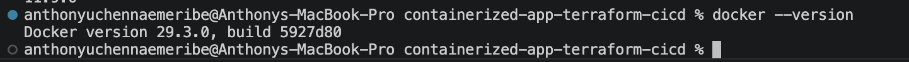

---

# INSTALL TERRAFORM


1. Run to install:

```bash
brew tap hashicorp/tap

brew install hashicorp/tap/terraform
```

2. In instances where an upgrade is required, run:

```bash
brew upgrade hashicorp/tap/terraform
```
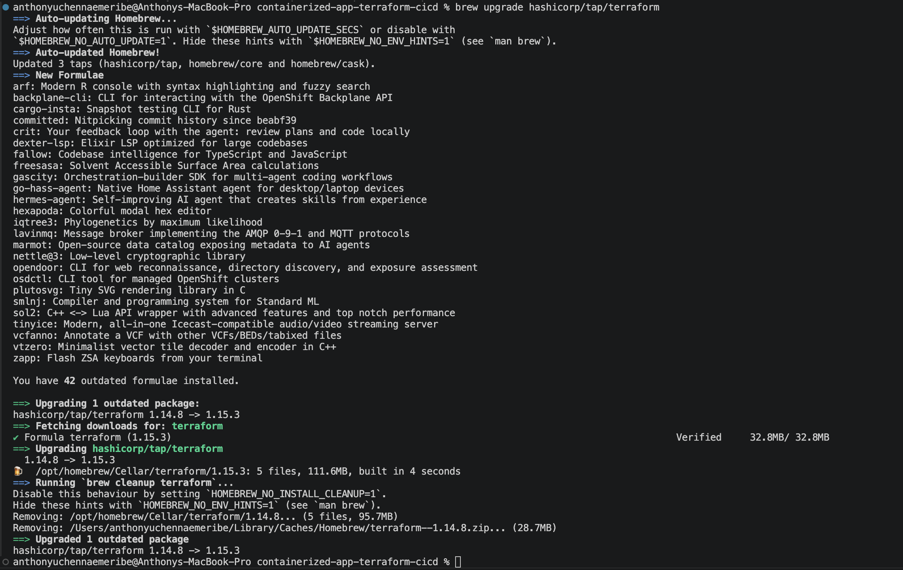

3. Verify:

```bash
terraform version
```

Expected:

```text
Terraform v1.5.x
```

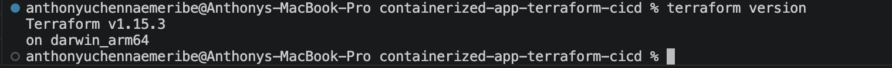

---

# INSTALL AWS CLI

Install:

```bash
brew install awscli
```

Verify:

```bash
aws --version
```

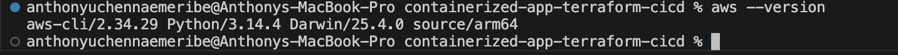

---

# INSTALL GITHUB CLI


1. Install:

```bash
brew install gh
```

2. Verify:

```bash
gh --version
```

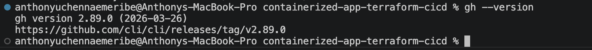

3. Upgrade:

```bash
brew upgrade gh
```
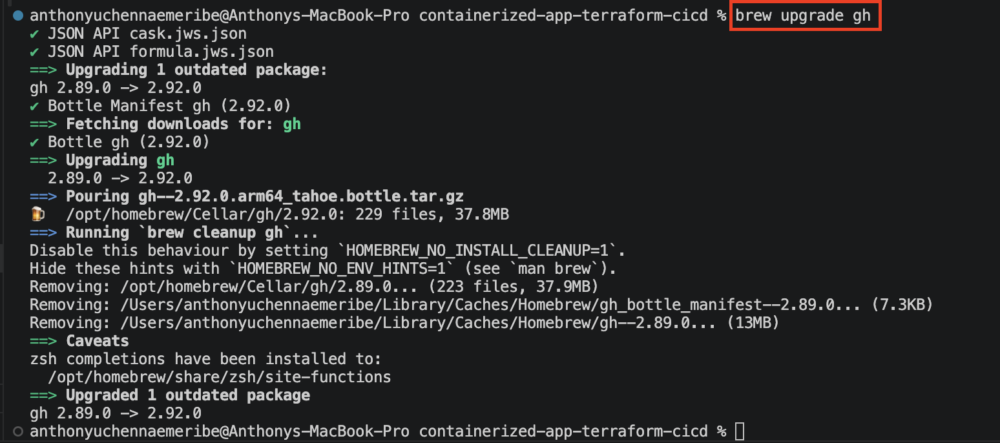
---

# INSTALL GRAPHVIZ


Install:

```bash
brew install graphviz
```

Verify:

```bash
dot -V
```

---

# ⚙️ STEP 2 — CONFIGURE AWS


Run:

```bash
aws configure
```

Enter:

```text
AWS Access Key ID
AWS Secret Access Key
AWS Region
Output Format
```

Example:

```text
us-east-1
json
```

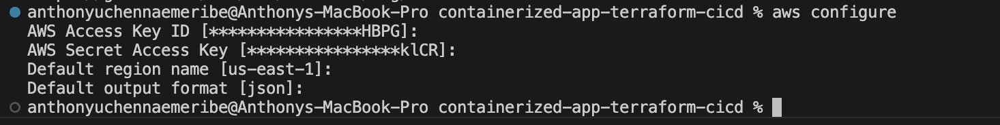

Verify authentication:

```bash
aws sts get-caller-identity
```

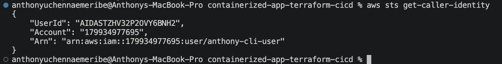

---

# ⚙️ STEP 3 — GENERATE SSH KEYS

Generate keys:

```bash
ssh-keygen -t rsa -b 4096
```

Press ENTER through prompts.

Verify:

```bash
ls ~/.ssh
```

Expected:

```text
id_rsa
id_rsa.pub
```
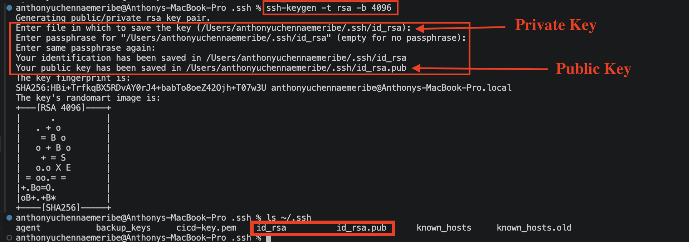
---

# ⚙️ STEP 4 — CREATE PROJECT DIRECTORY

```bash
mkdir containerized-app-terraform-cicd

cd containerized-app-terraform-cicd
```
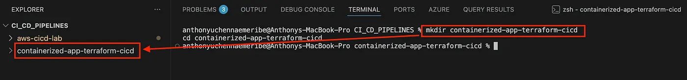
---

# ⚙️ STEP 5 — INITIALIZE NODE PROJECT

```bash
npm init -y

npm install express
```
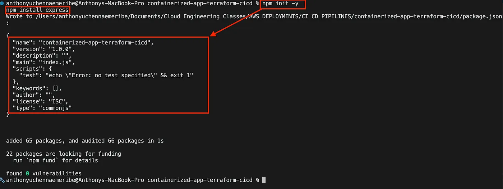
---

# ⚙️ STEP 6 — CREATE PROJECT STRUCTURE

1. Create directories:

```bash
mkdir -p terraform docs scripts .github/workflows screenshots
```

2. Create files:

```bash
touch app.js

touch README.md

touch .gitignore

touch .dockerignore

touch Dockerfile

touch ecosystem.config.js

touch package-lock.json

touch terraform/main.tf

touch terraform/versions.tf

touch terraform/variables.tf

touch terraform/outputs.tf

touch terraform/terraform.tfvars

touch docs/architecture.dot

touch docs/architecture-diagram.png

touch scripts/wait-for-instance.sh

touch .github/workflows/deploy.yml

touch .github/workflows/destroy.yml
```
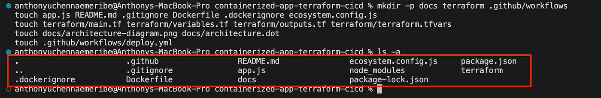

3. Verify structure:

```bash
tree -L 3 -I "node_modules|.git|.terraform"
```
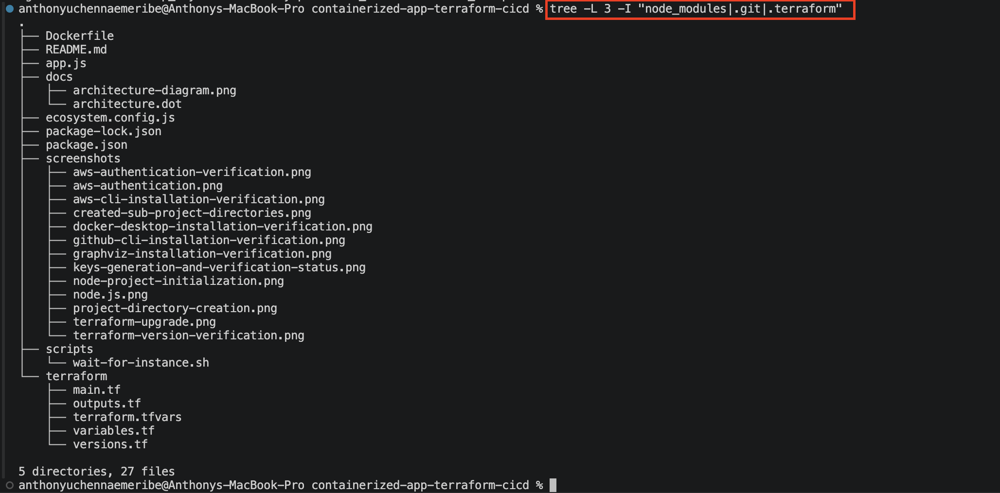
---

# ⚙️ STEP 7 — CREATE EXPRESS APPLICATION
# FILE: app.js

1. Open:

```bash
nano app.js
```

2. Paste:

```javascript
// =========================================
// 🚀 Import Dependencies
// =========================================
const express = require('express');

const app = express();

// =========================================
// ⚙️ Application Configuration
// =========================================
const PORT = 3000;

// =========================================
// 🌐 Root Endpoint
// =========================================
app.get('/', (req, res) => {

  res.send(`
    <html>
      <head>
        <title>Enterprise CI/CD Recovery Pipeline</title>

        <style>
          body {
            font-family: Arial, sans-serif;
            background-color: #0f172a;
            color: #ffffff;
            display: flex;
            justify-content: center;
            align-items: center;
            height: 100vh;
            margin: 0;
            text-align: center;
          }

          .container {
            max-width: 800px;
            padding: 40px;
          }

          h1 {
            color: #38bdf8;
            font-size: 2.5rem;
          }

          p {
            font-size: 1.2rem;
            line-height: 1.8;
          }

          .status {
            margin-top: 30px;
            padding: 15px;
            background-color: #1e293b;
            border-radius: 10px;
          }

          .highlight {
            color: #22c55e;
            font-weight: bold;
          }
        </style>
      </head>

      <body>

        <div class="container">

          <h1>
            🚀 Enterprise CI/CD Recovery Pipeline Active
          </h1>

          <p>
            Stable Infrastructure + Application-Level Deployment
          </p>

          <div class="status">

            <p>
              ✅ Infrastructure Status:
              <span class="highlight">STABLE</span>
            </p>

            <p>
              ✅ Deployment Strategy:
              <span class="highlight">ENTERPRISE CI/CD</span>
            </p>

            <p>
              ✅ Downtime Strategy:
              <span class="highlight">MINIMAL</span>
            </p>

            <p>
              ✅ Domain:
              <span class="highlight">
                https://auemeribetech.com.ng
              </span>
            </p>

          </div>

        </div>

      </body>
    </html>
  `);

});

// =========================================
// ❤️ Health Check Endpoint
// =========================================
app.get('/health', (req, res) => {

  res.json({
    status: "OK",
    deployment: "PRODUCTION",
    infrastructure: "STABLE",
    architecture: "ENTERPRISE_CICD",
    domain: "https://auemeribetech.com.ng"
  });

});

// =========================================
// ▶️ Start Server
// =========================================
app.listen(PORT, () => {

  console.log(`
=========================================
🚀 ENTERPRISE CI/CD PIPELINE ACTIVE
=========================================
Application Running on Port ${PORT}
=========================================
`);

});
```

3. Save:

```text
CTRL + X
Y
ENTER
```
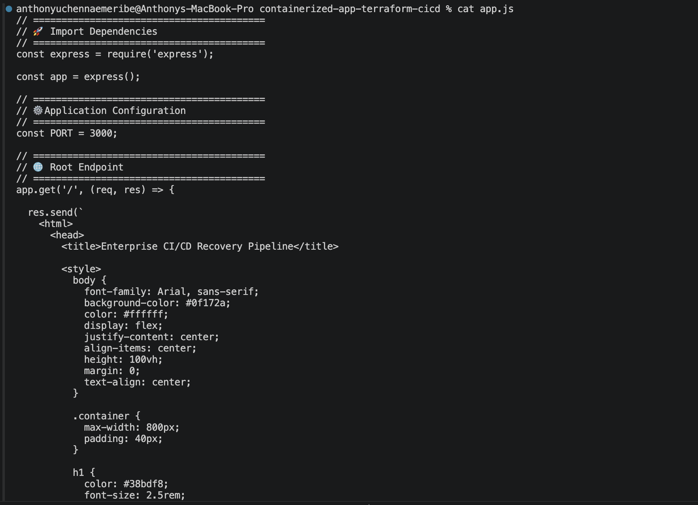
---

# ⚙️ STEP 8 — UPDATE package.json
# FILE: package.json

1. Open:

```bash
nano package.json
```

2. Replace with:

```json
{
  "name": "dynamic-recovery-app",
  "version": "1.0.0",
  "description": "Ephemeral Infrastructure Recovery Pipeline",
  "main": "app.js",
  "scripts": {
    "start": "node app.js",
    "test": "curl -f http://localhost:3000/health || exit 1"
  },
  "dependencies": {
    "express": "^4.18.2"
  }
}
```

3. Save:

```text
CTRL + X
Y
ENTER
```
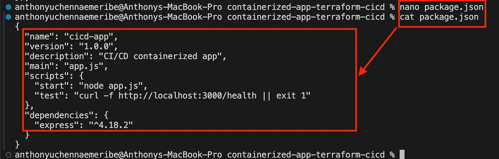
---

# ⚙️ STEP 9 — CREATE ecosystem.config.js
# FILE: ecosystem.config.js

1. Open:

```bash
nano ecosystem.config.js
```

2. Paste:

```javascript
module.exports = {
  apps: [
    {
      name: "cicd-app",
      script: "app.js",
      instances: 1,
      autorestart: true,
      watch: false,
      max_memory_restart: "200M",
      env: {
        NODE_ENV: "production",
        PORT: 3000
      }
    }
  ]
};
```
3. Save:

```text
CTRL + X
Y
ENTER
```
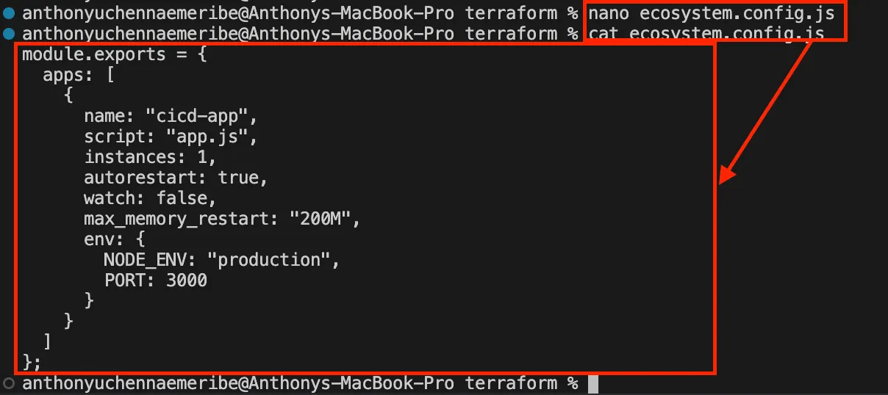
---

# ⚙️ STEP 10 — TEST APPLICATION

1. Start application:

```bash
npm start
```

2. Open browser:

```text
http://localhost:3000
```

3. Expected:

```text
🚀 Dynamic Infrastructure Recovery Pipeline Active!
```
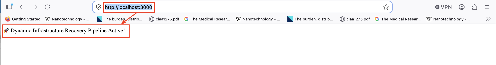

4. Test health endpoint:

```bash
curl http://localhost:3000/health
```

5. Expected:

```json
{
  "status": "OK",
  "recovery_mode": "ENABLED"
}
```
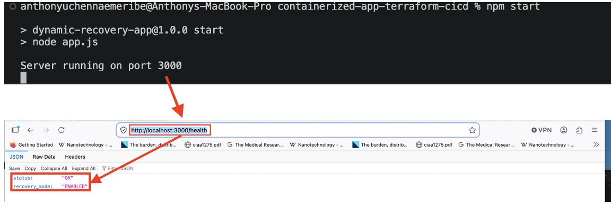
---

# ⚙️ STEP 11 — CREATE Dockerfile
# FILE: Dockerfile

1. Open:

```bash
nano Dockerfile
```

2. Paste:

```dockerfile
# ==========================================================
# DOCKERFILE
# ==========================================================
# =========================================
# 🐳 Base Image (Base environment)
# =========================================
FROM node:18-alpine

# =========================================
# 📁 Set Working Directory (Where app runs)
# =========================================
WORKDIR /app

# =========================================
# 📦 Copy Dependencies (Faster dependency caching)
# =========================================
COPY package*.json ./

# =========================================
# ⚙️ Install Production Dependencies (Install only the dependencies your app needs to run)
# =========================================
RUN npm install --production

# =========================================
# 📂 Copy Application Source Code
# =========================================
COPY . .

# =========================================
# 🌐 Expose Application Port
# =========================================
EXPOSE 3000

# =========================================
# ▶️ Start Application (Server)
# =========================================
CMD ["node", "app.js"]
```
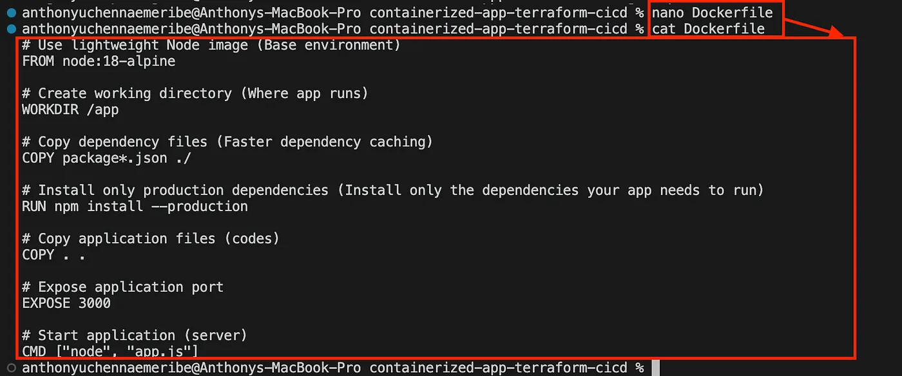
---

# ⚙️ STEP 12 — CREATE .dockerignore
# FILE: .dockerignore

Open:

```bash
nano .dockerignore
```

Paste:

```text
node_modules
.git
.env
docs
terraform
.github
```
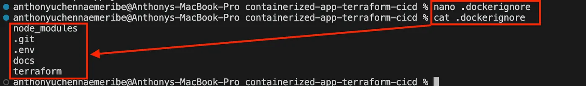
---

# ⚙️ STEP 13 — CREATE .gitignore
# FILE: .gitignore

1. Open:

```bash
nano .gitignore
```

2. Paste:

```text
# Node.js
node_modules/
npm-debug.log

# Environment variables
.env

# OS files
.DS_Store
Thumbs.db

# Logs
logs/
*.log

# Terraform
terraform/.terraform/
terraform/*.tfstate
terraform/*.tfstate.backup
terraform.tfstate
terraform.tfstate.backup
tfplan
*.tfplan
.terraform/
*.tfstate
*.tfstate.*
crash.log
override.tf
override.tf.json
*_override.tf
*_override.tf.json
.terraform.lock.hcl

# SSH Keys
*.pem
*.key

# Docker
docker-compose.override.yml

# IDE
.vscode/
.idea/
```
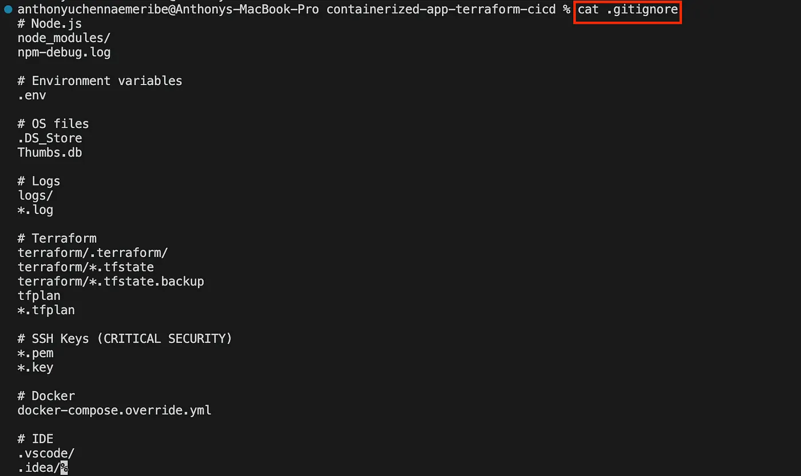
---

# ⚙️ STEP 14 — BUILD DOCKER IMAGE

1. Build image:

```bash
docker buildx build --platform linux/amd64 -t uchennaemeribe/dynamic-recovery-app:latest --push .
```
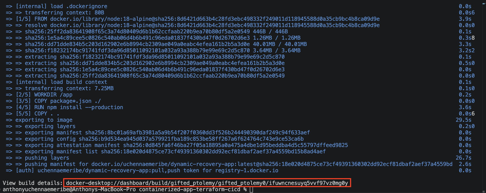

2. Run container:

```bash
docker run -d -p 3000:3000 dynamic-recovery-app
```
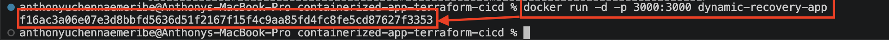

3. Verify:

```bash
curl http://localhost:3000/health
```
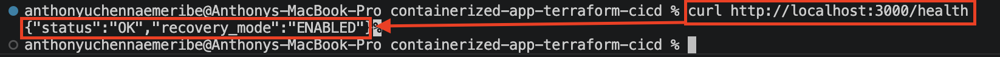
---

# ⚙️ STEP 15 — LOGIN TO DOCKER HUB

1. Login:

```bash
docker login
```
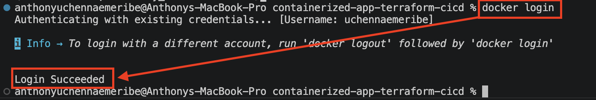

2. Create Docker Hub repository:
a. Go to:

Docker Hub Repository Creation Page(https://hub.docker.com/repositories?utm_source=chatgpt.com)

Then:

i. Click Create Repository
ii. Repository name:
```text
dynamic-recovery-app
```
iii. Choose:
    * Public OR Private
iv. Click Create

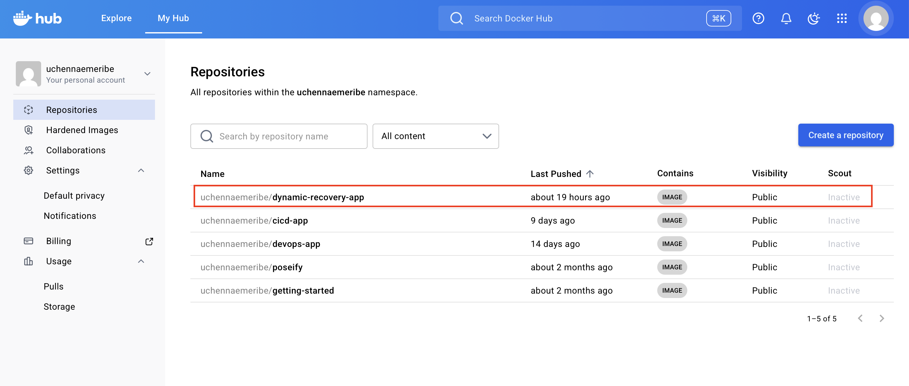

b. Tag image:

```bash
docker tag dynamic-recovery-app YOUR_DOCKER_USERNAME/dynamic-recovery-app:tagname
# By Substituting for the Docker Hub Username
docker tag dynamic-recovery-app uchennaemeribe/dynamic-recovery-app:latest
```


b. Push image:

```bash
docker push uchennaemeribe/dynamic-recovery-app:latest
```
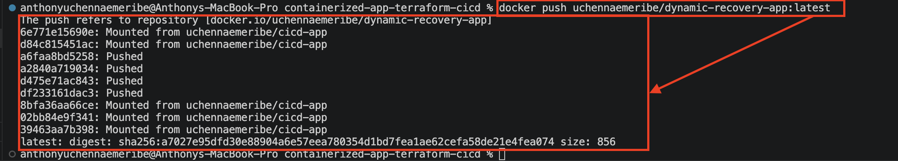

d. Verify tag:
```bash
curl -s https://registry.hub.docker.com/v2/repositories/uchennaemeribe/dynamic-recovery-app/tags | jq -r '.results[].name'
```
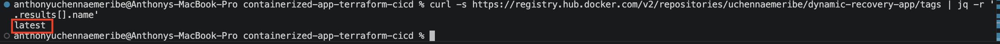

e. The browser can be used to verify the existence of the pushed tagged dockerhub image:

---

# ⚙️ STEP 16 — CREATE REMOTE TERRAFORM STATE INFRASTRUCTURE

# CREATE S3 BUCKET

```bash
aws s3api create-bucket --bucket dynamic-recovery-terraform-state --region us-east-1
```

IMPORTANT:

Bucket names MUST be globally unique.

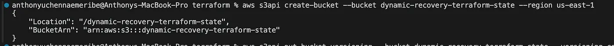

---

# ENABLE VERSIONING

```bash
aws s3api put-bucket-versioning --bucket dynamic-recovery-terraform-state --versioning-configuration Status=Enabled
```

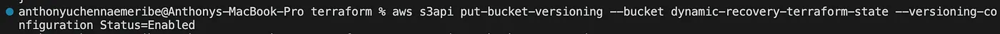

---

# ENABLE ENCRYPTION

```bash
aws s3api put-bucket-encryption --bucket dynamic-recovery-terraform-state --server-side-encryption-configuration '{
  "Rules": [
    {
      "ApplyServerSideEncryptionByDefault": {
        "SSEAlgorithm": "AES256"
      }
    }
  ]
}'
```

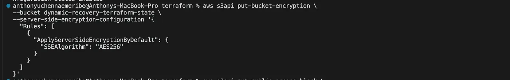

---

# BLOCK PUBLIC ACCESS

```bash
aws s3api put-public-access-block --bucket dynamic-recovery-terraform-state --public-access-block-configuration BlockPublicAcls=true,IgnorePublicAcls=true,BlockPublicPolicy=true,RestrictPublicBuckets=true
```

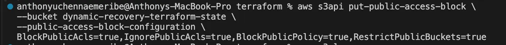

---

# VERIFY BUCKET

1. Run:

```bash
aws s3 ls
```

2. You should see:

```text
dynamic-recovery-terraform-state
```

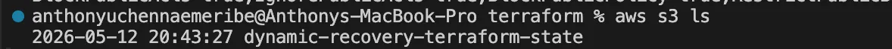

---

# NATIVE S3 STATE LOCKING

Terraform now uses native S3 lockfile state locking directly from the backend configuration in:

```text
terraform/versions.tf
```

Using:

```hcl
use_lockfile = true
```

This removes the need for a separate DynamoDB locking table.

Benefits include:

✔ Simpler architecture  
✔ Fewer AWS resources  
✔ Lower infrastructure management overhead  
✔ Native Terraform state locking  
✔ Cleaner enterprise backend configuration

---

# REINITIALIZE TERRAFORM BACKEND

After updating the backend configuration, reinitialize Terraform:

```bash
terraform init -reconfigure
```

Terraform will now automatically manage state locking using the S3 backend lockfile mechanism.

---

# ⚙️ STEP 17 — CREATE ROUTE53 HOSTED ZONE

1. Create hosted zone:

```bash
aws route53 create-hosted-zone --name auemeribetech.com.ng --caller-reference "$(date +%s)"
```
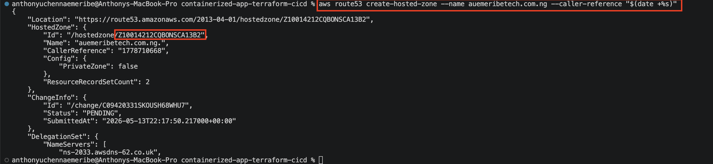

2. Retrieve hosted zones properly:
i. Run:
```bash
aws route53 list-hosted-zones
```
.png)

ii. Alternatively, the host zones can be retrieved using:
```bash
aws route53 list-hosted-zones-by-name
```
.png)

3. Retrieve Route53 nameservers:
i. Run
```bash
aws route53 get-hosted-zone --id HOSTED_ZONE_ID

# Substituting for HOSTED_ZONE_ID
aws route53 get-hosted-zone --id Z04577001PKHX4712KXO
```
.png)

ii. Alternatively, the host zones can be retrieved using:
```bash
aws route53 get-hosted-zone --id Z04577001PKHX4712KXO --query "DelegationSet.NameServers"
```
.png)

4. Expected:

```text
ns-827.awsdns-39.net
ns-281.awsdns-35.com
ns-1979.awsdns-55.co.uk
ns-1424.awsdns-50.org
```

---

# ⚙️ STEP 18 — UPDATE QSERVERS NAMESERVERS

1. Login to:
- QServers
2. Proceed to:
- My Damin
2. Click on:
- My Domain

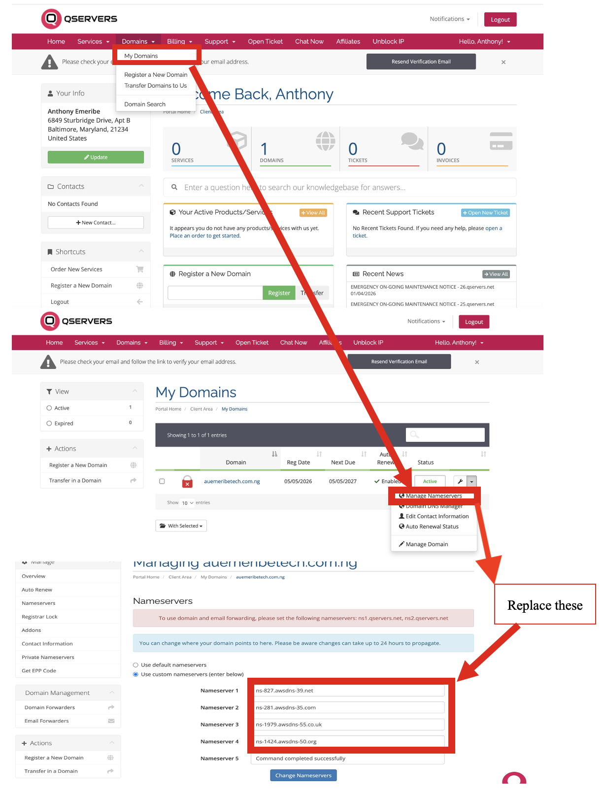

2. Replace existing nameservers with Azure nameservers.

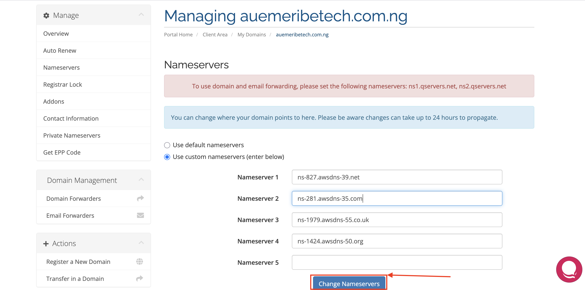

3. Wait for propagation

4. After approximately 10–15 minutes, verify that the domain is now using Azure DNS nameservers.

Run:

```bash
dig auemeribetech.com.ng NS
```
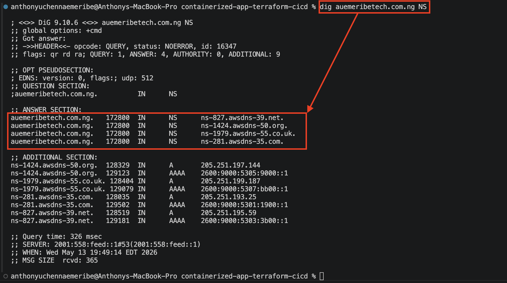

---

# ⚙️ STEP 19 — CREATE TERRAFORM CONFIGURATION
# FILE: terraform/versions.tf

1. Open:

```bash
nano terraform/versions.tf
```

2. Paste:

```hcl
# ============================================================
# FILE: terraform/versions.tf
# PURPOSE:
# Terraform Version + Provider Management
# ============================================================

terraform {

  required_version = ">= 1.5.0"

  required_providers {

    aws = {
      source  = "hashicorp/aws"
      version = "~> 5.0"
    }

    random = {
      source  = "hashicorp/random"
      version = "~> 3.5"
    }
  }

# ==========================================================
# REMOTE TERRAFORM STATE
# ==========================================================

  backend "s3" {

    bucket = "dynamic-recovery-terraform-state"

    key = "global/terraform.tfstate"

    region = "us-east-1"

    use_lockfile = true

    encrypt = true
  }
}
```
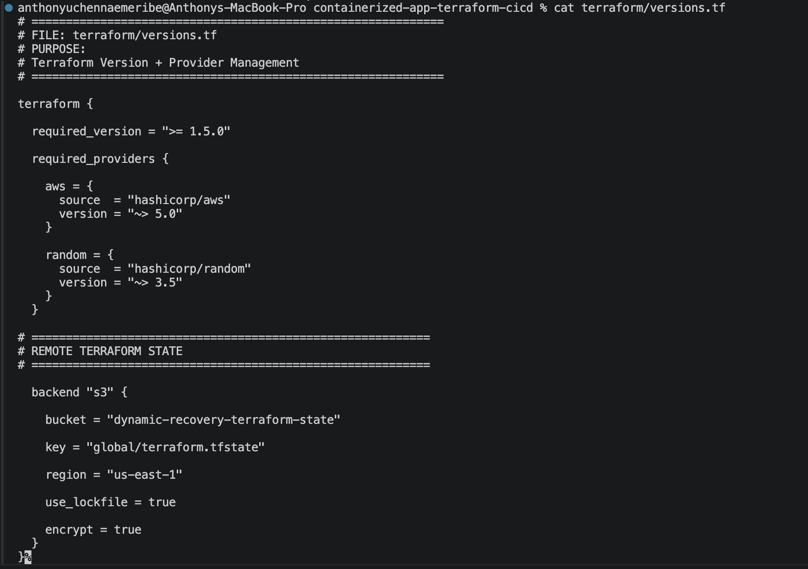
---

# ⚙️ STEP 20 — CREATE VARIABLES
# FILE: terraform/variables.tf

1. Open:

```bash
nano terraform/variables.tf
```

2. Paste:

```hcl
# ============================================================
# FILE: terraform/variables.tf
# PURPOSE:
# Terraform Variable Definitions
# ============================================================

# ============================================================
# AWS REGION
# ============================================================

variable "aws_region" {

  description = "AWS deployment region"

  type = string

  default = "us-east-1"
}
# ============================================================
# EC2 INSTANCE TYPE
# ============================================================
variable "instance_type" {

  description = "EC2 instance type"

  type = string

  default = "t3.micro"
}
# ============================================================
# SSH PUBLIC KEY
# ============================================================
variable "public_key" {

  description = "SSH public key"

  type = string
}
```
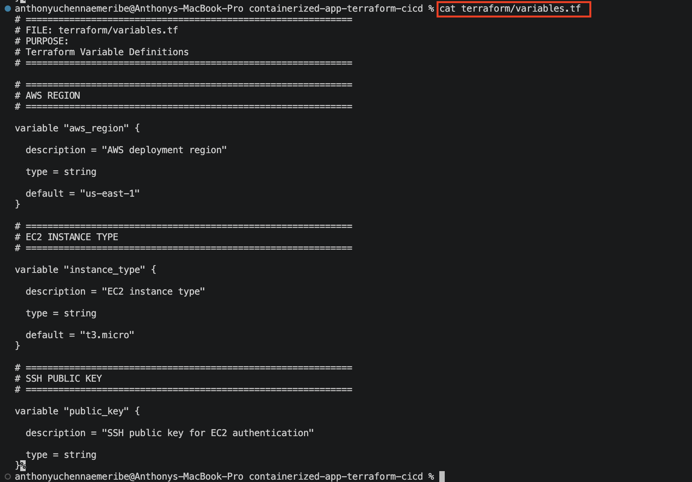
---

# ⚙️ STEP 21 — CREATE OUTPUTS
# FILE: terraform/outputs.tf

1. Open:

```bash
nano terraform/outputs.tf
```

2. Paste:

```hcl
# ==========================================================
# FILE: terraform/outputs.tf
# PURPOSE: Outputs ONLY
# ==========================================================
output "instance_public_ip" {
  value = aws_instance.app_server.public_ip
}

output "instance_public_dns" {
  value = aws_instance.app_server.public_dns
}
```
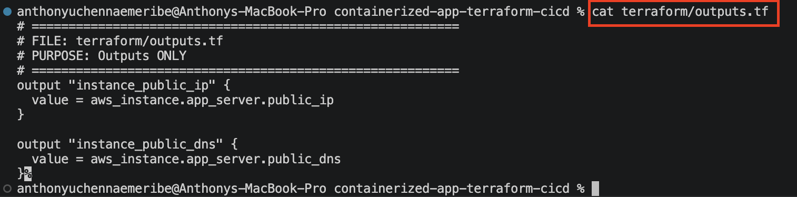
---

# ⚙️ STEP 22 — CREATE TERRAFORM VARIABLES
# FILE: terraform/terraform.tfvars

1. Open:

```bash
nano terraform/terraform.tfvars
```

2. Paste:

```hcl
# ==========================================================
# FILE: terraform/terraform.tfvars
# PURPOSE:
# Terraform Environment Configuration
# ==========================================================
aws_region = "us-east-1"

instance_type = "t3.micro"
```
[Terraform.tfvars Creation](screenshots/terraform.tfvars-creation.png)
---

# ⚙️ STEP 23 — CREATE MAIN TERRAFORM CONFIGURATION
# FILE: terraform/main.tf

Open:

```bash
nano terraform/main.tf
```

Paste:

```hcl
# ============================================================
# FILE: terraform/main.tf
# PURPOSE:
# Enterprise Stable Infrastructure Provisioning
#
# FEATURES:
# - Stable EC2 infrastructure
# - Docker auto-installation
# - Nginx reverse proxy
# - HTTPS-ready architecture
# - Persistent production infrastructure
# - Route53 automatic DNS management
# ============================================================

# ============================================================
# AWS PROVIDER CONFIGURATION
# ============================================================

provider "aws" {
  region = var.aws_region
}

# ============================================================
# EC2 SSH KEY PAIR
# ============================================================

resource "aws_key_pair" "deployer" {

  key_name = "enterprise-deployer-key"

  public_key = var.public_key
}

# ============================================================
# APPLICATION SECURITY GROUP
# ============================================================

resource "aws_security_group" "app_sg" {

  name = "enterprise-app-security-group"

  description = "Enterprise production security group"

  # ==========================================================
  # SSH ACCESS
  # ==========================================================

  ingress {

    description = "SSH Access"

    from_port = 22
    to_port   = 22

    protocol = "tcp"

    cidr_blocks = ["0.0.0.0/0"]
  }

  # ==========================================================
  # HTTP ACCESS
  # ==========================================================

  ingress {

    description = "HTTP Access"

    from_port = 80
    to_port   = 80

    protocol = "tcp"

    cidr_blocks = ["0.0.0.0/0"]
  }

  # ==========================================================
  # HTTPS ACCESS
  # ==========================================================

  ingress {

    description = "HTTPS Access"

    from_port = 443
    to_port   = 443

    protocol = "tcp"

    cidr_blocks = ["0.0.0.0/0"]
  }

  # ==========================================================
  # OUTBOUND ACCESS
  # ==========================================================

  egress {

    from_port = 0
    to_port   = 0

    protocol = "-1"

    cidr_blocks = ["0.0.0.0/0"]
  }

  tags = {
    Name = "enterprise-production-security-group"
  }
}

# ============================================================
# UBUNTU AMI LOOKUP
# ============================================================

data "aws_ami" "ubuntu" {

  most_recent = true

  owners = ["099720109477"]

  filter {
    name   = "name"
    values = ["ubuntu/images/hvm-ssd/ubuntu-jammy-22.04-amd64-server-*"]
  }

  filter {
    name   = "virtualization-type"
    values = ["hvm"]
  }
}

# ============================================================
# EC2 APPLICATION SERVER
# ============================================================

resource "aws_instance" "app_server" {

  ami = data.aws_ami.ubuntu.id

  instance_type = var.instance_type

  key_name = aws_key_pair.deployer.key_name

  vpc_security_group_ids = [
    aws_security_group.app_sg.id
  ]

  associate_public_ip_address = true

  # ==========================================================
  # SERVER INITIALIZATION
  # ==========================================================

  user_data = <<-EOF
              #!/bin/bash

              apt-get update -y

              apt-get install -y \
                docker.io \
                nginx \
                certbot \
                python3-certbot-nginx \
                git \
                curl

              systemctl enable docker
              systemctl start docker

              systemctl enable nginx
              systemctl start nginx

              usermod -aG docker ubuntu
              EOF

  tags = {
    Name        = "enterprise-production-server"
    Environment = "production"
    ManagedBy   = "terraform"
    Project     = "dynamic-recovery-app"
  }
}

# ============================================================
# ROUTE53 HOSTED ZONE LOOKUP
# ============================================================

data "aws_route53_zone" "main" {

  name = "auemeribetech.com.ng"

  private_zone = false
}

# ============================================================
# AUTOMATIC DNS RECORD
# ============================================================

resource "aws_route53_record" "app_dns" {

  zone_id = data.aws_route53_zone.main.zone_id

  name = "auemeribetech.com.ng"

  type = "A"

  ttl = 300

  records = [
    aws_instance.app_server.public_ip
  ]
}
```
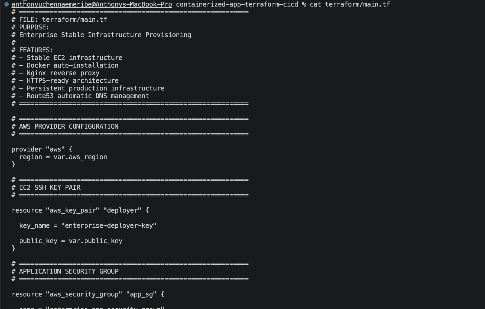
---

# ⚙️ STEP 24 — CREATE WAIT SCRIPT
# FILE: scripts/wait-for-instance.sh

1. Open:

```bash
nano scripts/wait-for-instance.sh
```

2. Paste:

```bash
#!/bin/bash

INSTANCE_IP=$1

echo "======================================="
echo "WAITING FOR EC2 INSTANCE INITIALIZATION"
echo "======================================="

SUCCESS=false

for i in {1..30}
do

  echo "Attempt $i of 30"

  ssh -i ~/.ssh/aws_key_pair \
    -o StrictHostKeyChecking=no \
    -o ConnectTimeout=10 \
    ubuntu@$INSTANCE_IP \
    "docker --version" && SUCCESS=true && break

  echo "Docker not ready yet..."

  sleep 10
done

if [ "$SUCCESS" != "true" ]; then

  echo "======================================="
  echo "INSTANCE INITIALIZATION FAILED"
  echo "======================================="

  exit 1
fi

echo "======================================="
echo "INSTANCE IS READY"
echo "======================================="
```

3. Make executable:

```bash
chmod +x scripts/wait-for-instance.sh
```
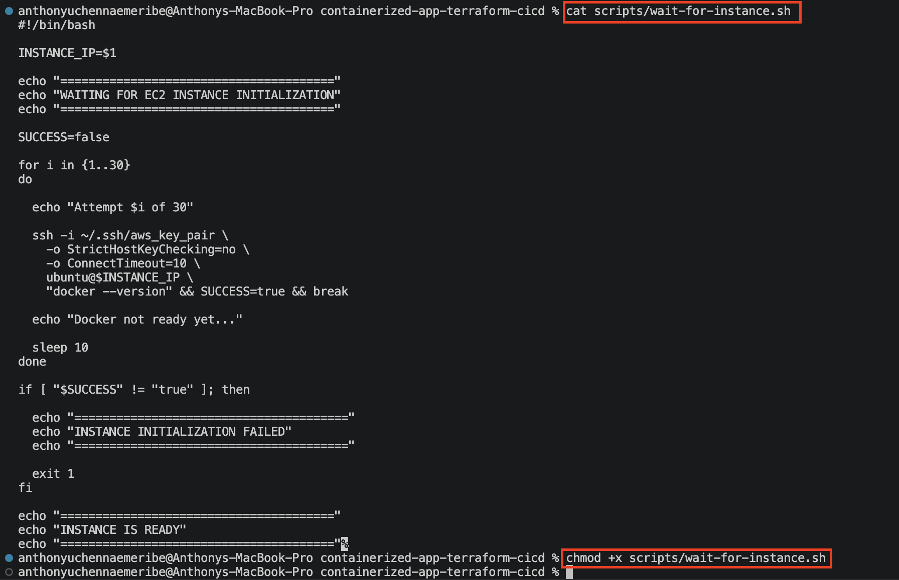
---

# ⚙️ STEP 25 — CREATE DEPLOY PIPELINE
# FILE: .github/workflows/deploy.yml

Open:

```bash
nano .github/workflows/deploy.yml
```

Paste:

```yaml
# ==========================================================
# FILE: .github/workflows/deploy.yml
# PURPOSE:
# Enterprise Production CI/CD Pipeline
#
# FEATURES:
# - Stable Infrastructure Architecture
# - Application-Level Deployment
# - Dockerized Application Deployment
# - Apple Silicon → AMD64 Compatibility
# - Zero Infrastructure Recreation During Deployments
# - Secure SSH Deployment
# - Docker Hub Integration
# - Minimal Downtime Deployment
# - Enterprise DevOps Workflow
# ==========================================================

name: Enterprise Application Deployment

on:
  push:
    branches:
      - main

# ==========================================================
# GLOBAL ENVIRONMENT VARIABLES
# ==========================================================

env:
  AWS_REGION: us-east-1

jobs:

# ==========================================================
# APPLICATION DEPLOYMENT JOB
# ==========================================================

  deploy:

    name: Deploy Updated Application to Existing Infrastructure

    runs-on: ubuntu-latest

    steps:

# ==========================================================
# CHECKOUT REPOSITORY
# ==========================================================

      - name: Checkout Repository
        uses: actions/checkout@v4

# ==========================================================
# LOGIN TO DOCKER HUB
# ==========================================================

      - name: Login to Docker Hub
        uses: docker/login-action@v3
        with:
          username: ${{ secrets.DOCKER_USERNAME }}
          password: ${{ secrets.DOCKER_PASSWORD }}

# ==========================================================
# SETUP DOCKER BUILDX
# REQUIRED FOR MULTI-ARCHITECTURE BUILDS
# ==========================================================

      - name: Set up Docker Buildx
        uses: docker/setup-buildx-action@v3

# ==========================================================
# BUILD AND PUSH DOCKER IMAGE
# APPLE SILICON → AMD64 COMPATIBILITY
# ==========================================================

      - name: Build and Push Docker Image
        run: |
          docker buildx build \
            --platform linux/amd64 \
            -t ${{ secrets.DOCKER_USERNAME }}/dynamic-recovery-app:latest \
            --push .

# ==========================================================
# CONFIGURE SSH PRIVATE KEY
# ==========================================================

      - name: Configure SSH Key
        run: |
          mkdir -p ~/.ssh

          echo "${{ secrets.VM_SSH_KEY }}" > ~/.ssh/aws_key_pair

          chmod 600 ~/.ssh/aws_key_pair

# ==========================================================
# ADD EC2 HOST TO KNOWN HOSTS
# ==========================================================

      - name: Add EC2 Host to Known Hosts
        run: |
          ssh-keyscan -H ${{ secrets.EC2_HOST }} >> ~/.ssh/known_hosts

# ==========================================================
# DEPLOY UPDATED APPLICATION
# EXISTING INFRASTRUCTURE REMAINS STABLE
# ==========================================================

      - name: Deploy Updated Docker Container
        run: |
          ssh -i ~/.ssh/aws_key_pair \
            ubuntu@${{ secrets.EC2_HOST }} << 'EOF'

            echo "======================================="
            echo "UPDATING APPLICATION CONTAINER"
            echo "======================================="

            until sudo docker info > /dev/null 2>&1
            do
              echo "Waiting for Docker daemon..."
              sleep 5
            done

            echo "Pulling latest Docker image..."

            sudo docker pull ${{ secrets.DOCKER_USERNAME }}/dynamic-recovery-app:latest

            echo "Stopping existing container..."

            sudo docker stop dynamic-recovery-app || true

            echo "Removing old container..."

            sudo docker rm dynamic-recovery-app || true

            echo "Starting updated container..."

            sudo docker run -d \
              --name dynamic-recovery-app \
              --restart unless-stopped \
              -p 3000:3000 \
              ${{ secrets.DOCKER_USERNAME }}/dynamic-recovery-app:latest

            echo "======================================="
            echo "APPLICATION UPDATE COMPLETE"
            echo "======================================="

          EOF

# ==========================================================
# VERIFY APPLICATION HEALTH
# ==========================================================

      - name: Verify Application Health
        run: |
          sleep 15

          curl -f https://auemeribetech.com.ng/health

# ==========================================================
# DEPLOYMENT SUCCESS OUTPUT
# ==========================================================

      - name: Deployment Complete
        run: |
          echo "======================================="
          echo "ENTERPRISE DEPLOYMENT SUCCESSFUL"
          echo "======================================="
          echo "Production URL:"
          echo "https://auemeribetech.com.ng"
          echo ""
          echo "Infrastructure Status:"
          echo "STABLE"
          echo ""
          echo "Deployment Strategy:"
          echo "APPLICATION-LEVEL UPDATE"
          echo ""
          echo "Infrastructure Recreation:"
          echo "DISABLED"
          echo "======================================="
```
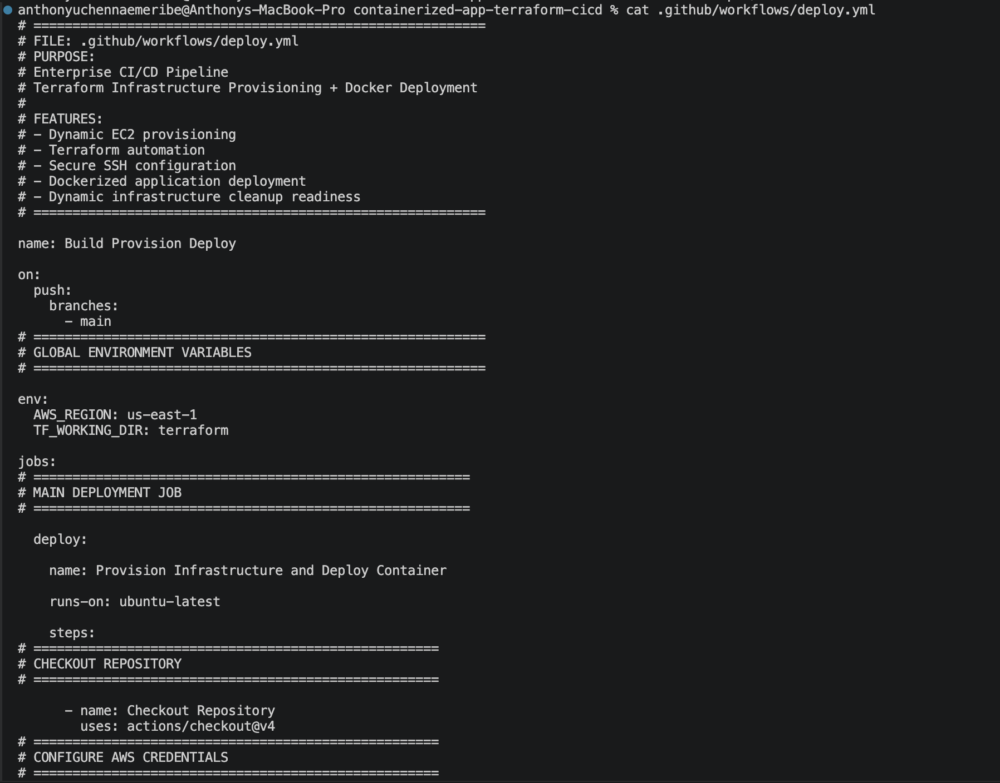
---

# ⚙️ STEP 26 — CREATE DESTROY PIPELINE
# FILE: .github/workflows/destroy.yml

Open:

```bash
nano .github/workflows/destroy.yml
```

Paste:

```yaml
# ==========================================================
# FILE: .github/workflows/destroy.yml
# ==========================================================

name: Destroy Infrastructure

on:
  workflow_dispatch:

jobs:

  destroy:

    runs-on: ubuntu-latest

    defaults:
      run:
        working-directory: terraform

    steps:
# =====================================================
# CHECKOUT
# =====================================================
      - name: Checkout Repository
        uses: actions/checkout@v4
# =====================================================
# AWS AUTHENTICATION
# =====================================================
      - name: Configure AWS Credentials
        uses: aws-actions/configure-aws-credentials@v4
        with:
          aws-access-key-id: ${{ secrets.AWS_ACCESS_KEY_ID }}
          aws-secret-access-key: ${{ secrets.AWS_SECRET_ACCESS_KEY }}
          aws-region: us-east-1
# =====================================================
# TERRAFORM SETUP
# =====================================================
      - name: Setup Terraform
        uses: hashicorp/setup-terraform@v3

      - name: Terraform Init
        run: terraform init

      - name: Terraform Validate
        run: terraform validate
# =====================================================
# TERRAFORM DESTROY
# =====================================================
      - name: Terraform Destroy
        run: |
          terraform destroy \
          -auto-approve \
          -var="public_key=${{ secrets.VM_PUBLIC_KEY }}"
```
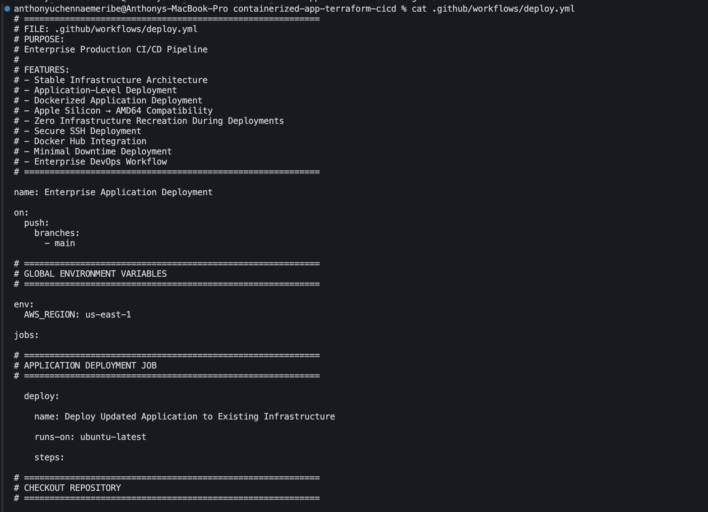
---

# ⚙️ STEP 27 — CREATE ARCHITECTURE DIAGRAM

Open:

```bash
nano docs/architecture.dot
```

Paste:

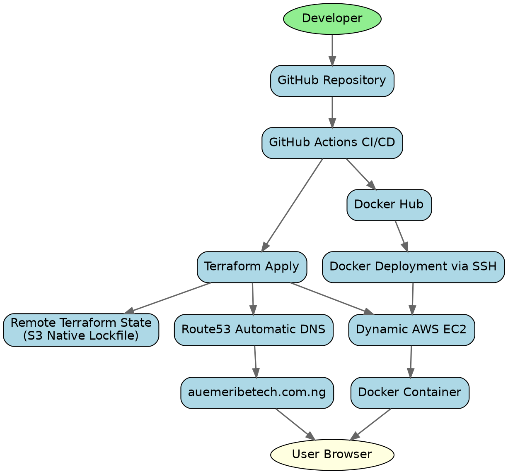
```dot
digraph G {

  rankdir=TB;

  bgcolor="white";

  node [
    shape=box,
    style="rounded,filled",
    fillcolor=lightblue,
    color=black,
    fontname="Helvetica"
  ];

  edge [
    color=gray40,
    penwidth=1.5
  ];

  Developer [shape=oval, fillcolor=lightgreen];

  GitHub [label="GitHub Repository"];

  GitHubActions [label="GitHub Actions CI/CD"];

  Terraform [label="Terraform Apply"];

  RemoteState [label="Remote Terraform State\n(S3 Native Lockfile)"];

  EC2 [label="Dynamic AWS EC2"];

  Route53 [label="Route53 Automatic DNS"];

  DockerHub [label="Docker Hub"];

  DockerDeploy [label="Docker Deployment via SSH"];

  Container [label="Docker Container"];

  Domain [label="auemeribetech.com.ng"];

  Browser [label="User Browser", shape=oval, fillcolor=lightyellow];

  Developer -> GitHub;

  GitHub -> GitHubActions;

  GitHubActions -> Terraform;

  Terraform -> RemoteState;

  Terraform -> EC2;

  GitHubActions -> DockerHub;

  DockerHub -> DockerDeploy;

  DockerDeploy -> EC2;

  EC2 -> Container;

  Terraform -> Route53;

  Route53 -> Domain;

  Domain -> Browser;

  Container -> Browser;
}
```
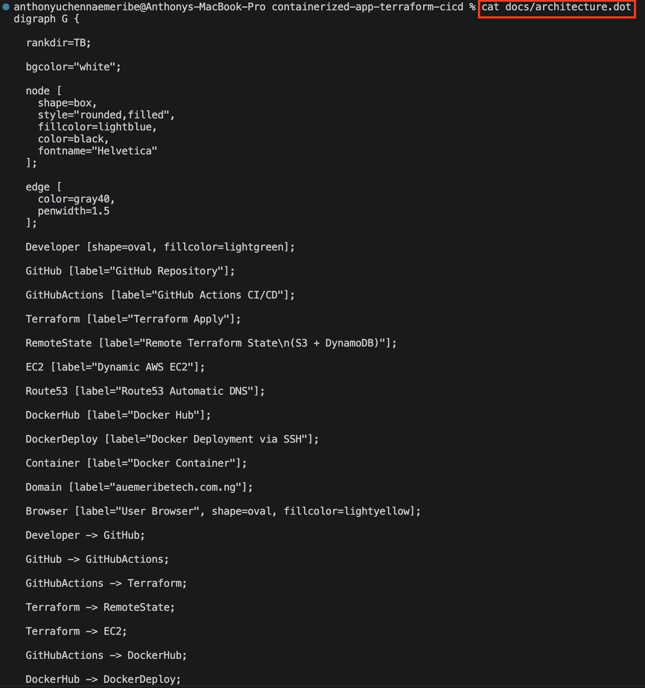

Generate architecture image:

```bash
dot -Tpng docs/architecture.dot -o docs/architecture-diagram.png
```

Open image:

```bash
open docs/architecture-diagram.png
```
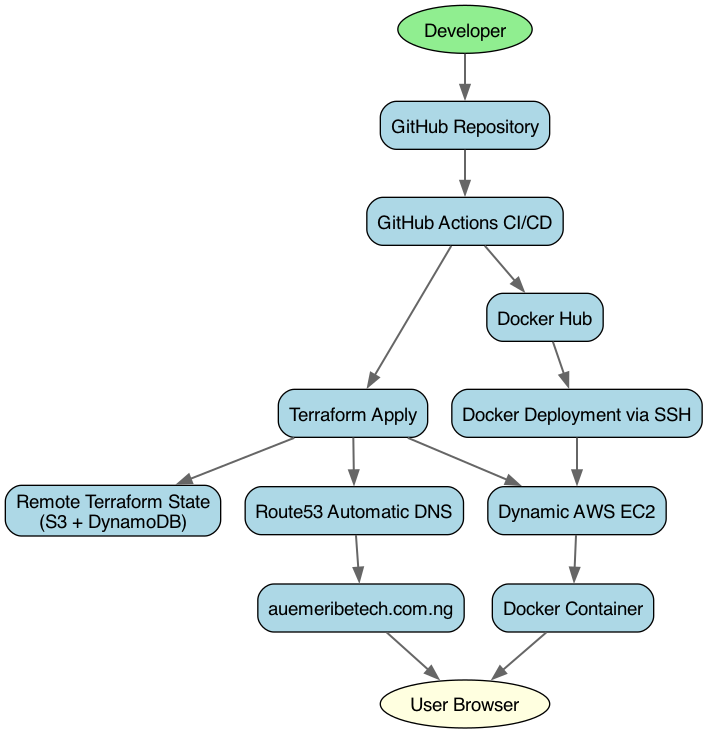
---

# ⚙️ STEP 28 — INITIALIZE TERRAFORM

1. Navigate:

```bash
cd terraform
```

2. Initialize:

```bash
terraform init
```
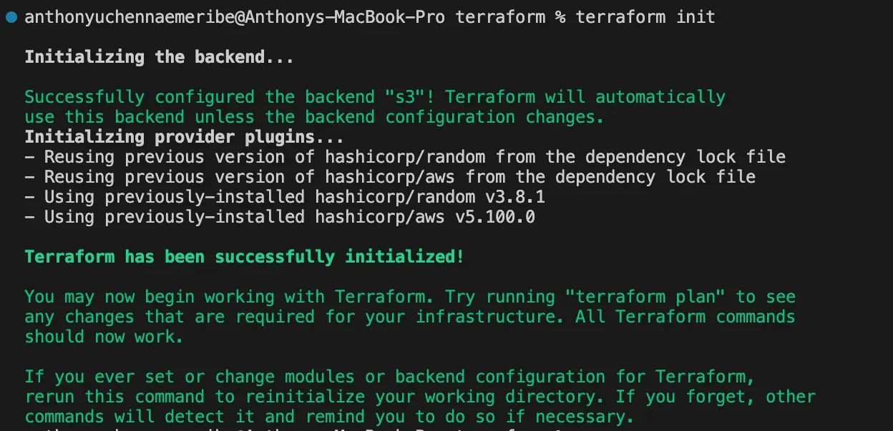

3. Validate:

```bash
terraform validate
```
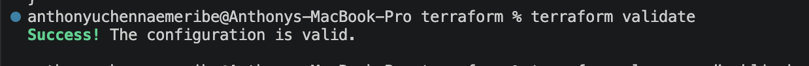

4. Plan:

```bash
terraform plan -var="public_key=$(cat ~/.ssh/id_rsa.pub)"
```

---

# ⚙️ STEP 29 — DEPLOY INFRASTRUCTURE

Deploy:

```bash
terraform apply -var="public_key=$(cat ~/.ssh/id_rsa.pub)"
```

Type:

```text
yes
```

Terraform automatically:

✔ Creates EC2  
✔ Creates Security Group  
✔ Creates AWS Key Pair  
✔ Creates Route53 DNS Record  
✔ Generates Dynamic Public IP  
✔ Updates Domain Automatically  

---

# ⚙️ STEP 30 — CONFIGURE NGINX REVERSE PROXY

After Terraform creates the EC2 server and Route53 DNS record, connect to the server and configure Nginx.

---
## RETRIEVE THE SERVER PUBLIC IP

You can retrieve the public IP using:

```bash
cd terraform

terraform output instance_public_ip
```
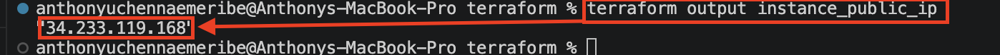

## SSH INTO EC2

Run:

```bash
ssh -i ~/.ssh/id_rsa ubuntu@YOUR_SERVER_PUBLIC_IP
```
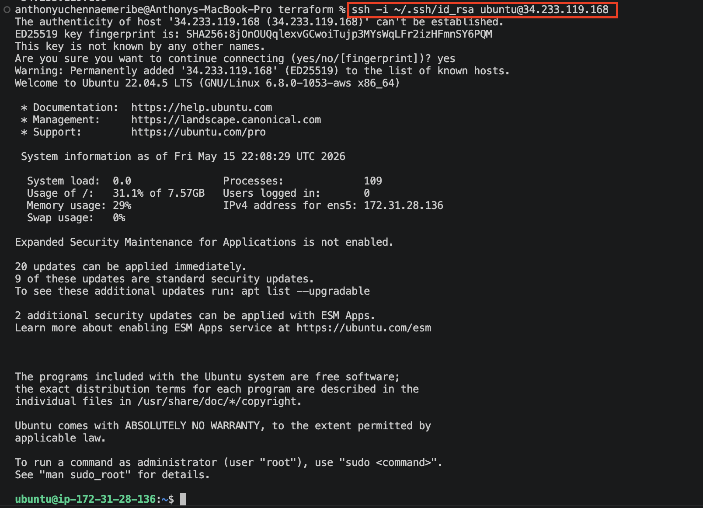


---

## CREATE NGINX CONFIGURATION

1. Open:

```bash
sudo nano /etc/nginx/sites-available/app
```

Paste:

```nginx
server {

    server_name auemeribetech.com.ng;

    location / {

        proxy_pass http://localhost:3000;

        proxy_http_version 1.1;

        proxy_set_header Upgrade $http_upgrade;

        proxy_set_header Connection 'upgrade';

        proxy_set_header Host $host;

        proxy_cache_bypass $http_upgrade;
    }
}
```
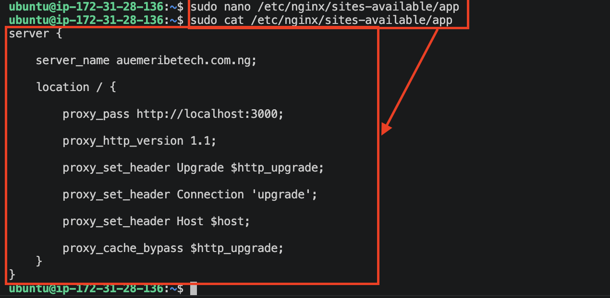
---

## ENABLE NGINX CONFIGURATION

Run:

```bash
sudo ln -s /etc/nginx/sites-available/app /etc/nginx/sites-enabled/
```
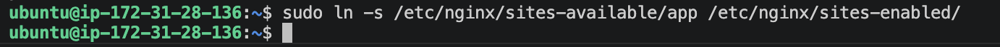
---

## REMOVE DEFAULT NGINX CONFIGURATION

Run:

```bash
sudo rm -f /etc/nginx/sites-enabled/default
```
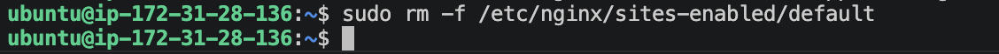
---

## TEST NGINX CONFIGURATION

Run:

```bash
sudo nginx -t
```

Expected:

```text
syntax is ok
test is successful
```
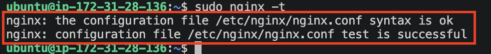
---

## RESTART NGINX

Run:

```bash
sudo systemctl restart nginx
```
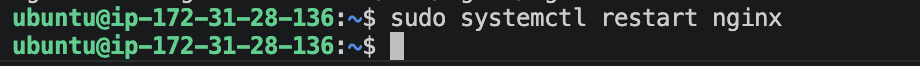
---

# ⚙️ STEP 31 — ENABLE HTTPS SSL

Now configure HTTPS SSL using Certbot.

---

## GENERATE SSL CERTIFICATE

1. Run:

```bash
sudo certbot --nginx -d auemeribetech.com.ng
```

---

## SELECT HTTPS REDIRECTION

When prompted, select:

```text
2: Redirect HTTP to HTTPS
```

This forces all traffic to use HTTPS automatically.

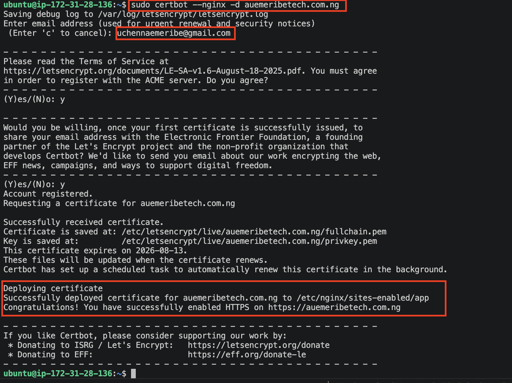
---

## VERIFY SSL

Open:

```text
https://auemeribetech.com.ng
```

You should now see:

✔ HTTPS enabled  
✔ Secure SSL lock icon  
✔ Enterprise reverse proxy architecture  
✔ Production-grade deployment  

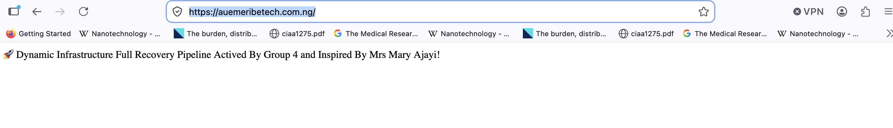
---

## VERIFY SSL RENEWAL

Run:

```bash
sudo certbot renew --dry-run
```

Expected:

```text
Congratulations, all simulated renewals succeeded
```
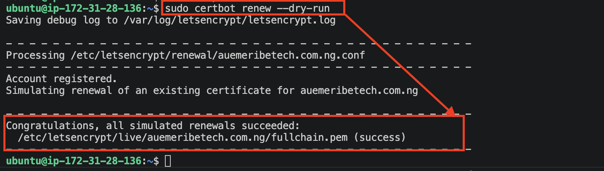
---

# ⚙️ STEP 32 — VERIFY LIVE DOMAIN

Open browser:

```text
https://auemeribetech.com.ng
```

Test health endpoint:

```bash
curl https://auemeribetech.com.ng/health
```

Expected:

```json
{
  "status": "OK",
  "deployment": "PRODUCTION",
  "infrastructure": "STABLE",
  "architecture": "ENTERPRISE_CICD"
}
```
# ⚙️ STEP 33 — VERIFY DOMAIN

1. Open browser:

```text
https://auemeribetech.com.ng
```

2. Expected:

```text
🚀 Dynamic Infrastructure Recovery Pipeline Active!
```
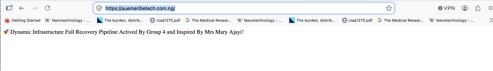

3. Test health endpoint:

```bash
curl https://auemeribetech.com.ng/health
```

Expected:

```json
{
  "status": "OK",
  "recovery_mode": "ENABLED"
}
```
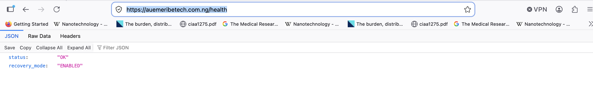
---

# ⚙️ STEP 34 — CONFIGURE GITHUB

1. Authenticate GitHub CLI:

```bash
gh auth login
```
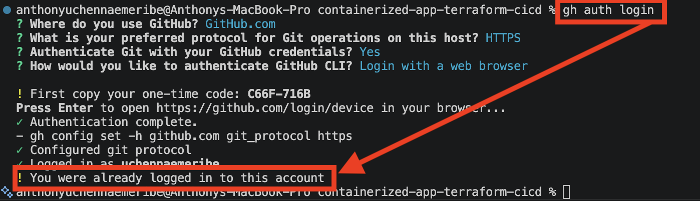

2. Initialize Git:

```bash
git init
```

3. Add files:

```bash
git add .
```
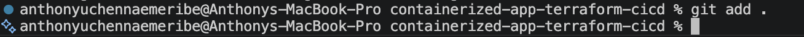

4. Commit:

```bash
git commit -m "Initial enterprise recovery architecture"
```
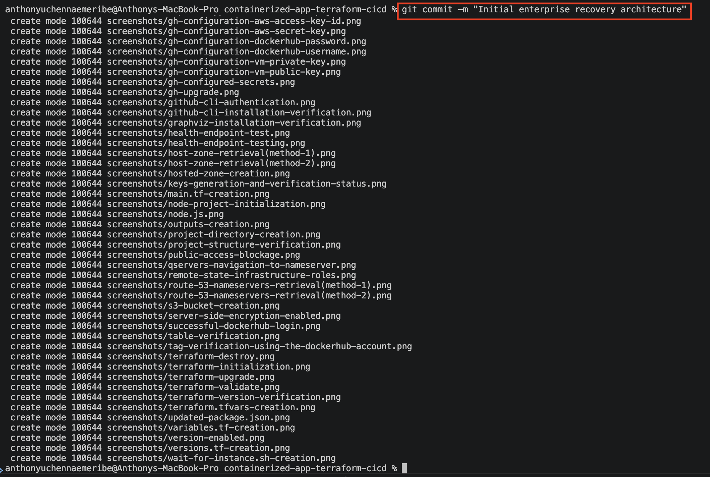

5. Rename branch:

```bash
git branch -M main
```

6. Create GitHub repository:

```bash
gh repo create containerized-app-terraform-cicd --public --source=. --remote=origin --push
```
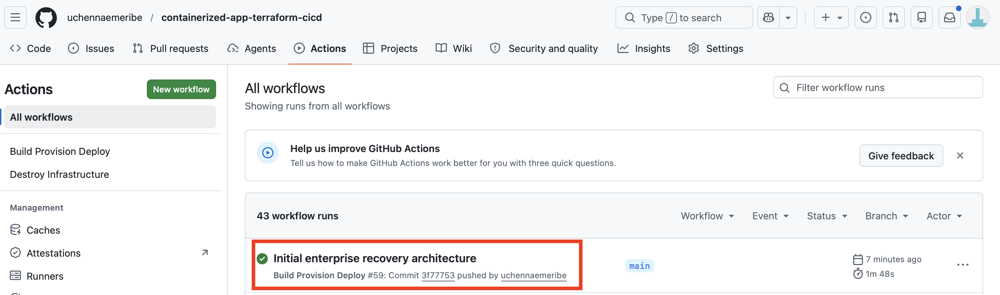
---

# ⚙️ STEP 35 — CONFIGURE GITHUB SECRETS

1. Set AWS Access Key:

```bash
gh secret set AWS_ACCESS_KEY_ID
```
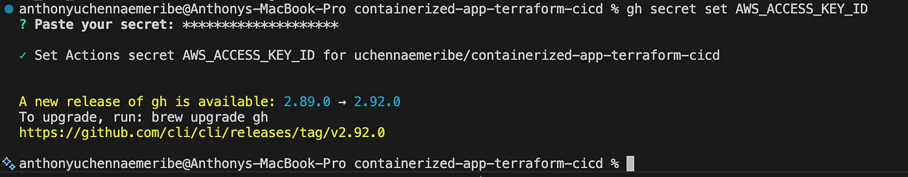

2. Set AWS Secret Key:

```bash
gh secret set AWS_SECRET_ACCESS_KEY
```


3. Set Docker Username:
a. Retrieve your dockerhub username using the following:
```text
i. Go to Docker Hub
ii. Log in
iii. Click your profile icon (top right)
iv. You'll see your username there, or in the URL: https://hub.docker.com/u/YOUR_USERNAME
```
b. Set using:
```bash
gh secret set DOCKER_USERNAME
```
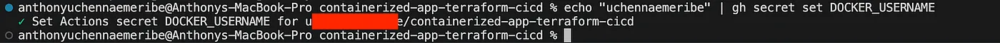

4. Set Docker Password:
a. Retrieve your generated token using the following:
```text
i. Go to: https://app.docker.com/accounts/your_docker_hub_username/settings/personal-access-tokens/
ii. Click "Generate new token
iii. Select: repo
iv. Copy the token

# Alternatively,
i.   Go to Docker Hub
ii.  Click Account Settings
iii. Go to Security → Access Tokens
iv.  Click New Access Token
```
b. Set using:
```bash
gh secret set DOCKER_PASSWORD
```
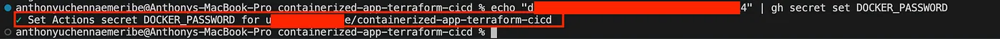

5. Set EC2 Public SSH Key:

```bash
gh secret set VM_PUBLIC_KEY < ~/.ssh/id_rsa.pub
```
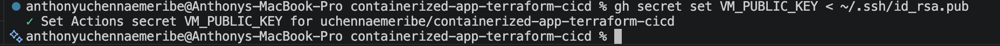

6. Set EC2 Private SSH Key:

```bash
gh secret set VM_SSH_KEY < ~/.ssh/id_rsa
```
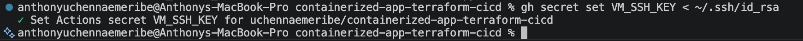

7. Set EC2 Host:
```bash
gh secret set EC2_HOST
```
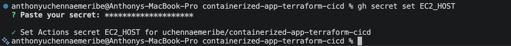

8. Verify secrets:

```bash
gh secret list
```

Expected:

```text
AWS_ACCESS_KEY_ID
AWS_SECRET_ACCESS_KEY
DOCKER_USERNAME
DOCKER_PASSWORD
VM_PUBLIC_KEY
VM_SSH_KEY
```
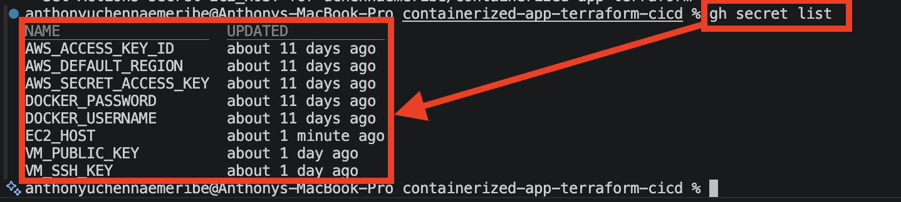
---

# ⚙️ STEP 36 — TEST GITHUB ACTIONS PIPELINE

Trigger pipeline:

```bash
git add .
git commit --allow-empty -m "trigger recovery pipeline"
```

Push:

```bash
git push
```

GitHub Actions automatically:

✔ Builds Docker image  
✔ Pushes image to Docker Hub  
✔ Creates infrastructure  
✔ Generates NEW public IP  
✔ Updates Route53 automatically  
✔ Deploys application automatically  
✔ Restores domain automatically  

---

# ⚙️ STEP 37 — VERIFY LIVE DOMAIN

Open browser:

```text
http://auemeribetech.com.ng:3000
```

Expected:

```text
🚀 Dynamic Infrastructure Recovery Pipeline Active!
```

---

# ⚙️ STEP 38 — DESTROY INFRASTRUCTURE

Navigate:

```bash
cd terraform
```

Initialize:

```bash
terraform init
```

Destroy:

```bash
terraform destroy -auto-approve -var="public_key=$(cat ~/.ssh/id_rsa.pub)"
```
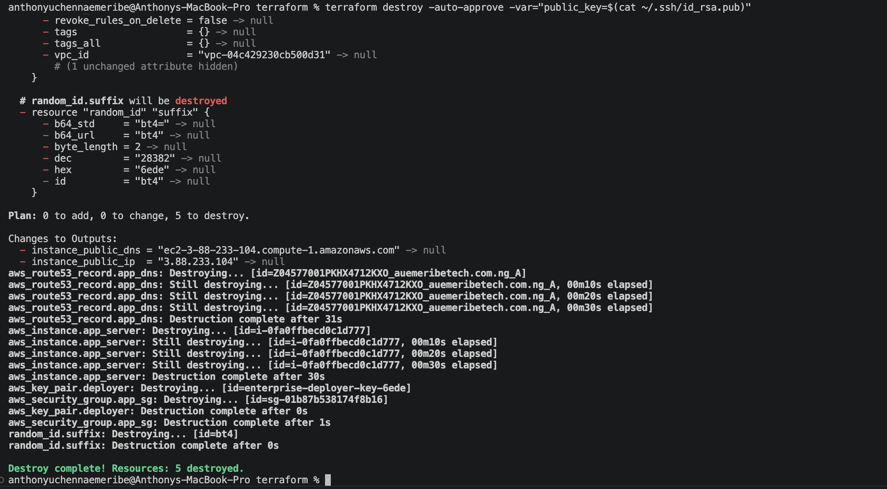

Removes:

✔ EC2  
✔ Security Groups  
✔ Route53 A Record  
✔ AWS Key Pairs  

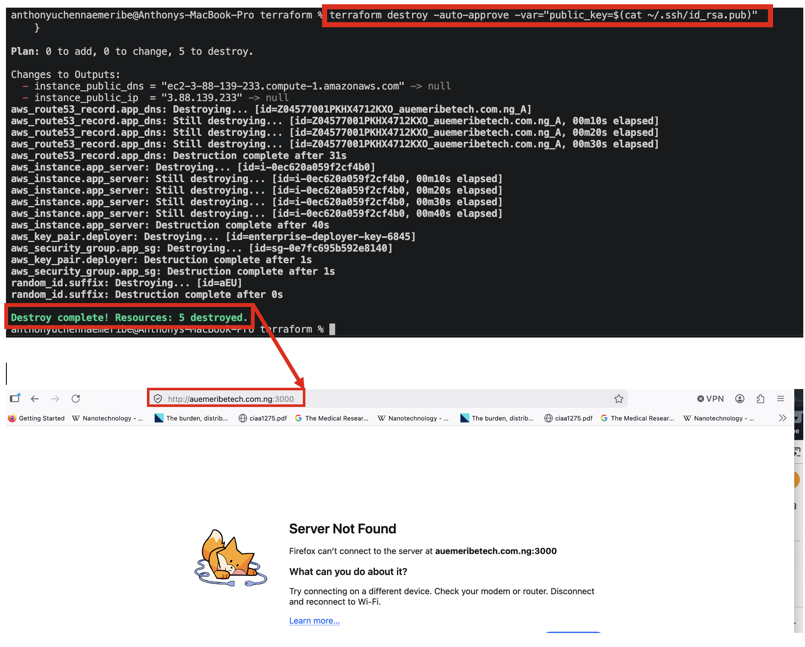
---

# ⚙️ STEP 36 — REACTIVATE INFRASTRUCTURE

1. Trigger pipeline again:

```bash
git add .
git commit --allow-empty -m "reactivate completed infrastructure"
```

2. Push:

```bash
git push
```

GitHub Actions automatically:

✔ Creates NEW EC2  
✔ Generates NEW Public IP  
✔ Updates Route53 Automatically  
✔ Deploys Docker Container  
✔ Restores Domain Automatically  

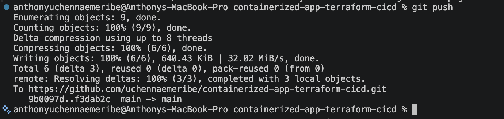
---

# ⚙️ STEP 39 — VERIFY AUTOMATIC DOMAIN RECOVERY

Open browser:

```text
http://auemeribetech.com.ng:3000
```

Expected:

```text
🚀 Dynamic Infrastructure Full Recovery Pipeline Active!
```
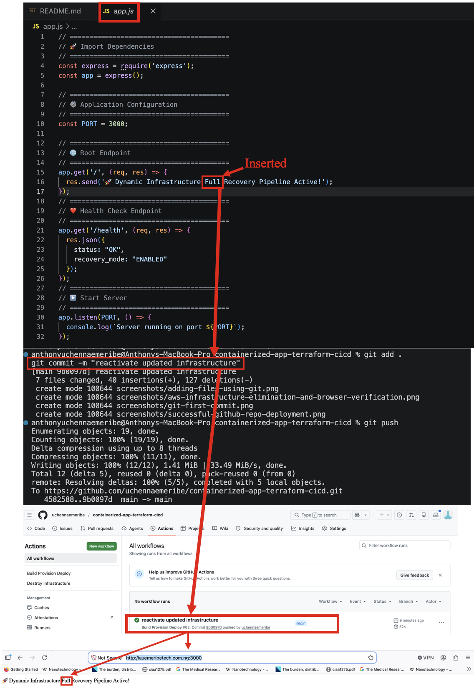
---

# 🧠 TYPICAL RECOVERY TIME

```text
Docker Build           → 20–60 seconds

Docker Push            → 10–30 seconds

SSH Deployment         → 5–15 seconds

Container Replacement  → 5–15 seconds

Application Restart    → 2–10 seconds

Fully Live             → ~1–2 minutes
```

---

# 🏁 FINAL PROJECT OUTCOME

You now have:

✔ Enterprise CI/CD Pipeline  
✔ Terraform Infrastructure Automation  
✔ Dynamic EC2 Recovery  
✔ Automatic Route53 DNS Recovery  
✔ Dockerized Deployment  
✔ GitHub Actions CI/CD  
✔ Remote Terraform State  
✔ Infrastructure Recovery Engineering  
✔ Ephemeral Infrastructure  
✔ Dynamic Public IP Recovery  
✔ Zero Idle AWS Cost Architecture  
✔ Self-Healing Cloud Infrastructure  
✔ Automatic Domain Restoration  
✔ Enterprise Disaster Recovery Workflow  

---

# 🚀 FINAL ENTERPRISE RECOVERY FLOW

```text
terraform destroy
       ↓
Infrastructure Removed
       ↓
Zero AWS Cost
       ↓
git push
       ↓
GitHub Actions Trigger
       ↓
Terraform Apply
       ↓
Remote State Recovery
       ↓
New EC2 Created
       ↓
New Public IP Generated
       ↓
Route53 DNS Updated Automatically
       ↓
Docker Container Redeployed
       ↓
auemeribetech.com.ng Live Again
```

---
# 🚀 PROJECT COMPLETE
---